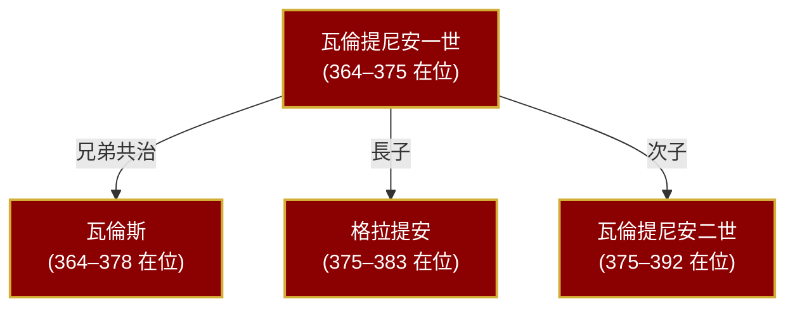
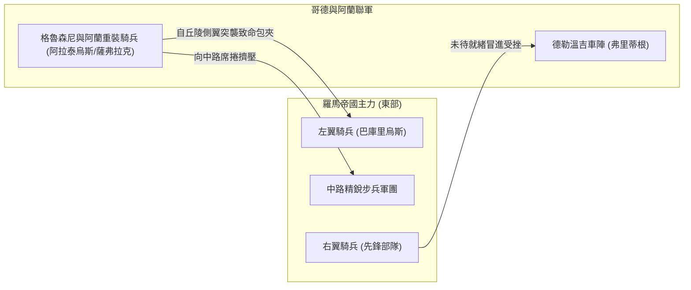

# 嵌入式互動圖表 (Mermaid / SVG) 規範與除錯工作流

本技能規範如何在歷史專題文章中設計、嵌入並調試 Mermaid 關係圖、世系譜系圖、戰役陣行佈署圖與時序流程圖，確保符合 [`AGENTS.md`](file:///c:/Users/USER/gemini%E7%9A%84%E7%B0%A1%E5%96%AE%E6%AD%B7%E5%8F%B2%E8%AA%B2/.agents/AGENTS.md) 的排版守則與跨裝置顯示穩定性。

---

## 核心排版與 CSS 防崩潰守則

在文章或獨立頁面中嵌入 Mermaid 或 SVG 時，必須嚴格遵守以下兩大規則：

### 1. 解鎖容器寬度限制（防止右側被剪裁）

* 定位容器（如 `.diagram-container` 或 `.mermaid-wrapper`）**禁止設定為固定百分比寬度（如 `width: 100%;`）**。
* 必須設定為 `width: auto;` 或 `width: max-content;`，確保容器能根據 SVG 實際寬度自然延展，使外層平移/縮放（Pan & Zoom）機制運作正常。

### 2. 強制覆寫全域 `pre` 滾動條樣式

全域樣式（如 `style.css`）中的 `pre, code { overflow-x: auto; }` 會造成圖表內部產生微型橫向滾動條。必須強制覆寫：

```css
.diagram-container pre,
.diagram-container .mermaid {
    overflow: visible !important;
    width: auto !important;
    max-width: none !important;
    background: transparent !important;
    margin: 0 !important;
    padding: 0 !important;
}
```

---

## Mermaid 語法防錯規範

為避免 Mermaid 解析器在瀏覽器端渲染失敗崩潰，必須遵守以下語法習慣：

1. **節點標籤字串一律用雙引號包覆**：
   * 包含括號、英文句點、冒號、引號或空格時，若未加雙引號會直接觸發語法解析錯誤。
   * **錯誤**：`valens[瓦倫斯 (364-378 在位)]`
   * **正確**：`valens["瓦倫斯 (364–378 在位)"]`
2. **避免在標籤內混入未轉義 HTML 標籤**：
   * 換行使用 `<br/>` 或在雙引號字串中換行，勿使用未閉合標籤。
3. **連線標籤安全性**：
   * 連線說明若含標點，亦應加雙引號：
   * `A -->|"378 年 8 月 9 日決戰"| B`

---

## 常用歷史圖表範本

### 1. 王朝世系與繼承關係 (Genealogy Graph)



### 2. 戰役陣型與衝突演進 (Battle Diagram)



---

## 發布前檢查清單

* [ ] 所有 Node ID 與 Label 均正確閉合雙引號。
* [ ] 容器 CSS 具備 `width: auto` 與 `overflow: visible`。
* [ ] 於 `index_db.html` 與獨立文章頁測試暗黑與明亮模式下的對比度與線條可讀性。
* [ ] 執行 `python run_build.py` 驗證編譯無異常。
