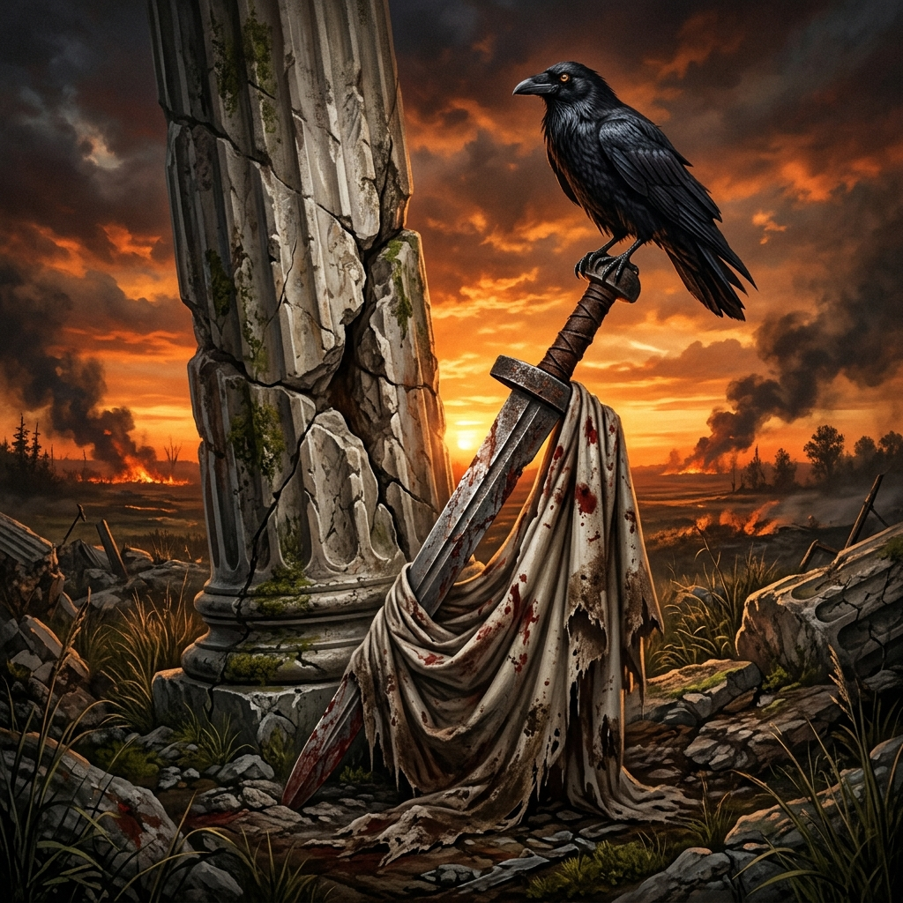

# 《鐵劍與托加》第一部大綱：《哥德風暴：多瑙河與帝國拯救者》（376 - 382 CE）

本大綱將這段六年哥德戰爭歷史劃分為 **1 個序章與 10 個正式章節**。故事採用雙線平行敘事：一邊是流浪的哥德人與未來王者阿拉里克、阿陶爾夫的「生存與覺醒線」；另一邊是羅馬救世主狄奧多西大帝的「起落與權術線」。

---

## 📖 章節規劃與情節大綱

### 序章：三船南渡，舊神的呢喃（太古 - 375 CE）
*   **核心事件**：哥德神話中的起源傳說，從斯堪地亞島（Scandza）到黑海之濱的千年遷徙。
*   **主要視角**：老高茲（Gaut，哥德始祖神/流浪者）。
*   **情節大綱**：
    *   以老高茲在北境冰川前的吟唱開場，講述哥德人古老的神話世界觀：始祖神高茲在冰雪中刻下盧恩符文，為子民指引方向。
    *   講述太古之時，傳奇國王**貝里格 (Berig)** 帶領族人，乘坐**三艘船**越過波羅的海。第一艘船載著東哥德人，第二艘船載著西哥德人，而第三艘船走得最慢，載著被嘲笑為「遲緩者」的格皮德人。
    *   這支民族穿過無盡的北方黑森林與普里皮亞季沼澤，在戰神特爾茲（Tyz）的庇護下南下，最終在溫暖肥沃的黑海北岸（斯基泰）定居，繁衍出龐大的部落。
    *   **終點與危機**：然而，千年的和平即將被打破。老高茲在頓河畔的微風中聞到了東方的血腥味，紅色的風暴（匈人）已然越過邊界。舊神睜開了獨眼，預見了這支「三船子民」即將迎來的諸神黃昏。

### 第一章：黃沙漫天，黑海落日（375 - 376 CE）
*   **核心事件**：匈人突襲，東哥德帝國覆滅，大遷徙序幕。
*   **主要視角**：老高茲（哥德舊神化身）、百歲東哥德老國王厄曼納里克。
*   **情節大綱**：
    *   從東方草原呼嘯而至的匈人可汗**巴蘭貝爾**越過頓河，以恐怖的騎射戰術橫掃東哥德。
    *   老國王厄曼納里克看著神像，絕望地發現雷神索爾並未降下雷霆，在匈人破城前夕悲憤自刎。
    *   **重要伏筆**：青年將領薩烏爾親自入宮勸老國王撤退被拒。薩烏爾最終大步離去，與宮殿外等候的東哥德將領阿拉修斯（Alatheus）、薩夫拉克（Saphrax）會合，一同護送著幼王維德里希（Widerich）以及三千名阿蘭重裝鐵甲騎兵向西突圍。這支隊伍正是日後重創羅馬邊防、決定阿德里安堡戰局的「東哥德攝政聯軍」之火種。
    *   老高茲在廢墟中為老國王合上雙眼，目睹了「舊神的日落」，動身前往西方，向西哥德人發出災難警報。

### 第二章：泰爾溫吉的血色篝火（370 - 375 CE）
*   **核心事件**：西哥德（泰爾溫吉部族）的宗教大清洗與部族內戰。
*   **主要視角**：阿薩納里克、弗里蒂根、少年阿拉里克（約7-12歲）。
*   **情節大綱**：
    *   展現阿薩納里克守護多神教傳統的決心。他發動基督教大清洗，強迫皈依者吃祭祀馬肉，火燒木製教堂。
    *   弗里蒂根因親羅馬與皈依亞利烏派的立場，起兵反抗阿薩納里克，爆發慘烈的部族內戰。
    *   弗里蒂根初戰失利，向東帝瓦倫斯求援。瓦倫斯派兵越河干預，擊敗阿薩納里克，迫使其退守山區。
    *   藉此鋪陳阿拉里克、弗雷雅、阿陶爾夫的動盪童年背景，在戰爭流離中展現青梅竹馬的牽絆。

### 第三章：德涅斯特河畔的決裂（376 CE 夏）
*   **核心事件**：匈人風暴壓境，西哥德大分裂，大遷移序幕。
*   **主要視角**：弗里蒂根、阿薩納里克、少年阿拉里克（13歲）、弗雷雅（9歲）。
*   **情節大綱**：
    *   面對步步逼近的匈人陰影，西哥德首領們召開篝火大會。
    *   保守派法官**阿薩納里克**堅持異教信仰，發誓「終身不踏上羅馬土地」，要進山死守；務實派**弗里蒂根**則抗命宣布全族皈依基督教（阿里烏派），向羅馬皇帝瓦倫斯乞求渡河落戶。
    *   **弗雷雅登場**：阿拉里克9歲的妹妹**弗雷雅**首度登場，在難民大遷移中與哥哥一同照顧6歲的阿陶爾夫。
    *   大會決裂，西哥德人一分為二。阿拉里克為了年幼的弗雷雅與阿陶爾夫的溫飽，毅然反抗要拉他去山裡的叔叔。叔叔痛打阿拉里克，弗雷雅挺身保護哥哥。最終，三人選擇跟隨弗里蒂根南下多瑙河，為未來的命運與青梅竹馬的感情埋下伏筆。

### 第四章：多瑙河畔，狗肉與黃金（376 CE 秋 - 冬）
*   **核心事件**：多瑙河難民危機，羅馬官員的極限剝削。
*   **主要視角**：阿拉里克（13歲）、弗里蒂根、羅馬督軍盧皮奇努斯。
*   **情節大綱**：
    *   二十萬飢寒交迫的難民齊聚多瑙河畔。東帝瓦倫斯下旨接納，企圖招募新兵。
    *   色雷斯督軍盧皮奇努斯等貪官中飽私囊，扣留朝廷物資，在黑市逼哥德人「用一個孩子換一隻死狗肉」。
    *   13歲的阿拉里克在屈辱中欲拔劍拼命，被弗里蒂根死死按住，學會了「將劍藏在骨頭裡」的隱忍。此時他與6歲的阿陶爾夫結下生死兄弟情。

### 第五章：馬爾恰諾堡的拔劍（377 CE 年初）
*   **核心事件**：總督府「鴻門宴」暗殺陰謀敗露，哥德起義爆發。
*   **主要視角**：弗里蒂根、盧皮奇努斯。
*   **情節大綱**：
    *   盧皮奇努斯在馬爾恰諾波里斯總督府設宴款待弗里蒂根等首領，實則暗中部署伏兵。
    *   宴會上暗殺敗露，弗里蒂根掀桌拔劍，砍倒羅馬衛兵，在阿拉里克的接應下殺出重圍。
    *   弗里蒂根在要塞外對著飢餓的族人發表起兵誓言。哥德人敲擊鐵盾，怒吼震天，用奪來的羅馬武器掃平了色雷斯的羅馬莊園。

### 第六章：西班牙的農夫與自負的皇帝（377 - 378 CE 春）
*   **核心事件**：狄奧多西隱居老家，瓦倫斯皇帝的政治危機與全員謀殺局。
*   **主要視角**：狄奧多西、東羅馬皇帝瓦倫斯、西羅馬皇帝格拉提安。
*   **情節大綱**：
    *   **狄奧多西**因為父親被冤殺，解甲歸田，在西班牙莊園冷眼旁觀東方的戰亂，默默躬耕積蓄實力。
    *   西羅馬青年皇帝格拉提安在西部戰場大敗日耳曼人，威震四方。格拉提安與手下法蘭克名將梅羅鮑德斯、里科默斯暗中佈局，意圖藉蠻族之手除掉政敵皇叔瓦倫斯。
    *   東帝瓦倫斯深感嫉妒，加之他在神學上與君士坦丁堡主流不和，急需一場獨自消滅蠻族的輝煌勝利來證明其合法性，一步步踏入各方勢力為他設下的死局。

### 第七章：巴爾幹的黑夜哨火（378 CE 夏）
*   **核心事件**：塞巴斯蒂安努斯的游擊戰，格拉提安催命信抵達，阿德里安堡大決戰前夜。
*   **主要視角**：塞巴斯蒂安努斯、弗里蒂根、瓦倫斯。
*   **情節大綱**：
    *   羅馬悲劇名將塞巴斯蒂安努斯推行夜襲游擊戰，重創哥德劫掠隊，迫使弗里蒂根收縮兵力。
    *   **伏筆收回**：第一章隨薩烏爾突圍西逃的東哥德攝政將領阿拉修斯與薩夫拉克，此時護送著幼王維德里希，率領精銳重騎兵強行越河進入羅馬境內，與弗里蒂根暗中結盟。
    *   格拉提安大軍抵達卡斯特拉馬蒂斯（色雷斯門戶），派遣法蘭克將領里科默斯攜催命信勸阻瓦倫斯。字裏行間對軍功的炫耀精準刺痛瓦倫斯脆弱自尊，驅使瓦倫斯在八月酷暑下獨自出兵。

### 第八章：阿德里安堡的烈火與黑夜截殺（378 CE 8月9日）
*   **核心事件**：阿德里安堡戰役，瓦倫斯潰逃時被里科默斯密殺，哥德人背黑鍋。
*   **主要視角**：阿拉里克（15歲，弗里蒂根的侍從）、皇帝瓦倫斯、里科默斯。
*   **情節大綱**：
    *   八月烈日如火，羅馬軍隊疲憊飢渴。弗里蒂根故意放火燒荒，並利用假和談拖延時間。阿拉修斯與薩夫拉克重騎兵從高地雷霆衝下，撕裂羅馬軍團。
    *   **神級翻轉（黑夜截殺）**：瓦倫斯身負重傷逃出包圍圈，向卡斯特拉馬蒂斯方向逃去，遭遇格拉提安前鋒將領里科默斯。里科默斯冷酷拔劍截殺瓦倫斯：「一個死皇帝才能讓天下歸於格拉提安陛下。」
    *   里科默斯抹去瓦倫斯遺體痕跡，發布「皇帝身殉國難」宣告。哥德人背下咰君黑鍋，格拉提安名正言順以救世主姿態東進。15歲的阿拉里克在廢墟中看著帝國的血腥權術，完成了成人禮。

### 第九章：西班牙農夫的帝冕與雄獅（378 CE 底 - 380 CE）
*   **核心事件**：狄奧多西臨危即位（菩薩變雄獅），頒布《薩洛尼卡敕令》，主動推動軍隊蠻族化。
*   **主要視角**：狄奧多西、格拉提安、阿拉里克（17歲）。
*   **情節大綱**：
    *   格拉提安將狄奧多西從西班牙農田中請出，冊封為東羅馬皇帝（以為請來聽話的菩薩，沒想到放出了冷血雄獅）。
    *   狄奧多西看穿羅馬公民軍團易叛亂的實質，**主動推動軍隊蠻族化**，割地招安哥德人，將其培養為唯帝王個人是瞻的私人家奴軍。
    *   **神學枷鎖算計**：西元 380 年狄奧多西頒布《薩洛尼卡敕令》，將尼西亞天主教立為國教並廢除亞利烏派。對內拿下羅馬正統性，對外給信奉亞利烏派的哥德人戴上「永遠無法合法稱帝」的神學枷鎖，將其政治天花板鎖死為帝王專屬的僱傭軍。
    *   格拉提安對狄奧多西的「妥協割地」大失所望，理想破滅後沉迷阿蘭蠻族文化與打獵，與傳統羅馬軍隊產生深刻裂痕，為383年被叛軍所殺埋下伏筆。

### 第十章：帶血的盟約與帝國的覆滅（381 - 382 CE）
*   **核心事件**：阿薩納里克國葬，382年《同盟者條約》簽訂，新王權萌芽。
*   **主要視角**：狄奧多西、阿拉里克（19歲）、阿陶爾夫（12歲）。
*   **情節大綱**：
    *   弗里蒂根在無人可談判與饑荒中病逝。頑固的阿薩納里克在山中彈盡糧絕，被迫投降君士坦丁堡。狄奧多西親自扶棺舉辦極其奢華的羅馬國葬，從心理上徹底收服哥德貴族。
    *   西元 382 年，雙方簽署條約：哥德人作為「同盟者」定居色雷斯，免稅並保留武裝。
    *   大結局盛宴上，狄奧多西與蠻族舉杯。19歲的青年將領阿拉里克看穿了狄奧多西將哥德人當作內戰槍使的黑暗兵法。阿拉里克對12歲的阿陶爾夫低聲立誓：「記住羅馬人的權術，總有一天，我們要用自己的鐵劍拿下羅馬！」
    *   **尾聲伏筆**：遙寄未來阿陶爾夫迎娶加拉·普拉西提阿（狄奧多西之女），將長子取名「狄奧多西」，達成鐵劍與托加血脈合一的史詩終局。第一部完。
